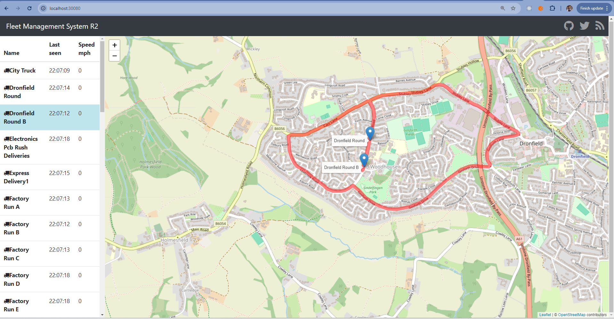
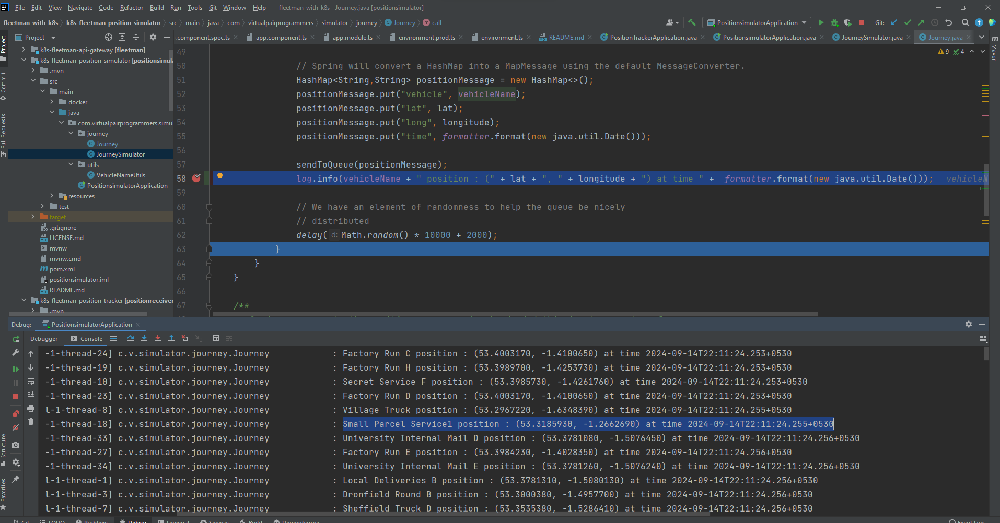

# k8s Fleetman

For running the app K8s:

Go to folder k8s_files, run below commands
 - kubectl apply -f mongo-stack.yaml  
 - kubectl apply -f services.yaml
 - kubectl apply -f storage.yaml
 - kubectl apply -f workloads.yaml

The web app can be accessed on:

http://localhost:30080

Use these commands to stop / remove the pods / services / storages

- kubectl delete -f mongo-stack.yaml
- kubectl delete -f services.yaml
- kubectl delete -f storage.yaml
- kubectl delete -f workloads.yaml

The PositionSimulator app and PositionTracker app codes are present along with Webapp in Angular for reference

